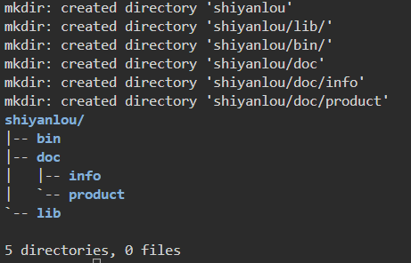

### mkdir
sudo apt-get update
sudo apt-get install tree

mkdir -vp shiyanlou/{lib/,bin/,doc/{info,product}}
tree shiyanlou/

### rm 
The function of thiscommand is to deleteone or more files ordirectories in adirectory. It can alsodelete a directory andall files andsubdirectories underit. For the link file,only the link isdeleted, and theoriginal file remainsunchanged.
"rm" is an abbreviation for remove.

Command Format:
`rm [options] file-or-directory`

answer:
1.D is a variable that receives routing, create a folder whose routing is D
Then move all the files into the folder

### mv
The mv command's function is to move files or change file names. It is a commonly used command on Linux systems and is often used to back up files or directories.

"mv" is an abbreviation of move.

Command Format:
`mv [options] source-file-or-directory target-file-or-directory`

### cp
The cp command is used to copy files or directories and is one of the most commonly used commands on Linux systems.

"cp" is an abbreviation for copy.

Command Format:
`cp [options] source-file directory`

### cat
The function of the cat command is to output a file or standard input combination to standard output. 

"cat" is an abbreviation for concatenate.

command format:
`cat [option] [file]`

answer:
1. this command show all the files in EOF

### nl
The nl command is used in the Linux system to calculate the number of lines in a file.

"nl" is an abbreviation for number of lines.

Command Format
`nl [option] file`